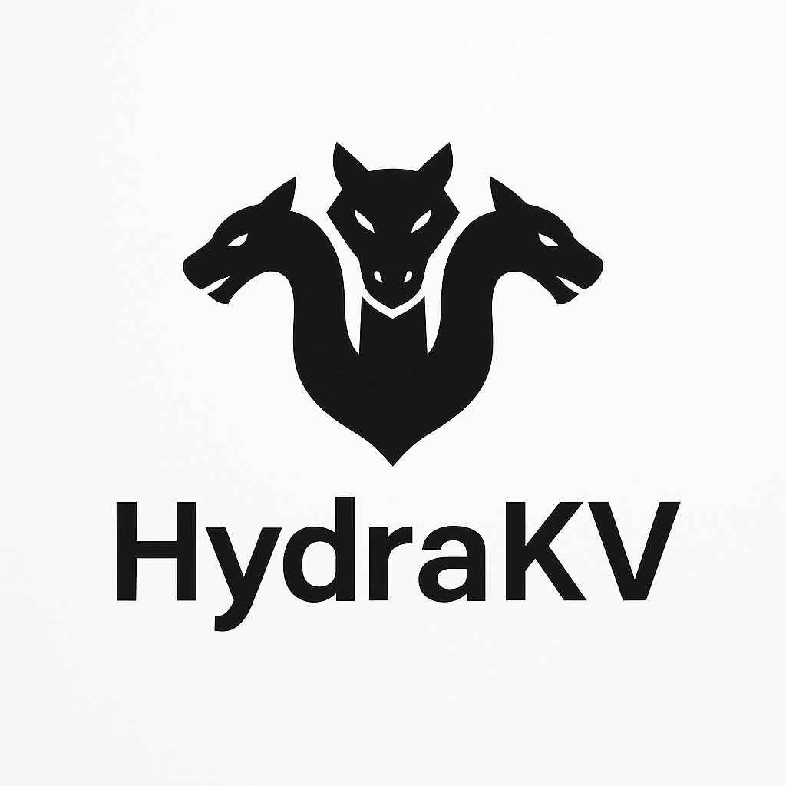

# HydraKV



We introduce **HydraKV** — a high-performance key-value store. Built with Go, HydraKV is a efficient core for distributed systems.

By leveraging sharded hash maps and asynchronous AOF persistence, HydraKV delivers a dual-interface powerhouse (HTTP & gRPC) designed to handle demanding workloads with minimal latency.

## ⚡ Features

- **High Performance**: Engineered for high-throughput and low-latency operations at its core.
- **Dual Interface**: Native support for both **RESTful HTTP** and **gRPC** APIs.
- **Reliable Persistence**: Uses **Append-Only File (AOF)** logging to ensure data durability.
- **Temporal Control**: Built-in Time-to-Live (TTL) management for automatic key expiration.
- **Memory Optimized**: Fine-tuned hash map implementation with configurable entry sizes.
- **Scalable Design**: Built-in request rate limiting and high-concurrency management via sharding.
- **Automatic Recovery**: Seamless database restoration upon restart, ensuring data consistency.
- **Efficient Concurrency**: Harnesses a configurable CPU multiplier for optimized parallelism.
- **Cloud Native**: Designed for containerized environments, fully configurable via environment variables.

## ⚠️ Security Warning

**HydraKV does not implement native TLS (Transport Layer Security).**

All communication is unencrypted by default. For production environments, it is **highly recommended** to secure HydraKV behind a reverse proxy like **Traefik**, **Nginx**, or **Caddy** to handle SSL/TLS termination and provide an additional layer of security.

### API Key Authentication

When `HKV_APIKEY_ENABLED` is set to `true`, HydraKV requires an API key for all database-specific operations. 
- **HTTP**: Include the API key in the `X-API-Key` header.
- **gRPC**: Include the API key in the `apikey` field of the request message.

The API key is returned when a database is created via `POST /create` or the gRPC `CreateDB` method. You can also rotate the API key using the `UPDATE /db/{dbname}` endpoint.

---

## 🛠 Configuration (Environment Variables)

HydraKV is configured entirely via environment variables (prefixed with `HKV_`).

| Variable | Description | Default |
| :--- | :--- | :--- |
| `HKV_BIND_ADDRESS` | Address for the HTTP server to bind to | `0.0.0.0` |
| `HKV_PORT` | Port for the HTTP server | `9191` |
| `HKV_DB_FOLDER` | Directory where database files are stored | `./data` |
| `HKV_MAX_ENTRIES` | Maximum number of entries allowed per database | `100000` |
| `HKV_ENTRY_SIZE` | Maximum size of a single entry in bytes | `2048` |
| `HKV_APIKEY_ENABLED` | Enable API key authentication | `false` |
| `HKV_WRITE_TIMEOUT` | HTTP write timeout in seconds | `20` |
| `HKV_READ_TIMEOUT` | HTTP read timeout in seconds | `20` |
| `HKV_IDLE_TIMEOUT` | HTTP idle timeout in seconds | `20` |
| `HKV_MAX_HEADER_BYTES` | Maximum size of HTTP headers in bytes | `1024` |
| `HKV_METRICS_ENABLED` | Enable Prometheus metrics endpoint | `false` |
| `HKV_XXHASH_SEED` | Seed for the xxhash algorithm | `0` |
| `HKV_REQUEST_LIMIT` | Maximum HTTP requests per second | `500` |
| `HKV_GRPC_ENABLED` | Enable the gRPC server | `true` |
| `HKV_GRPC_PORT` | Port for the gRPC server | `9292` |
| `HKV_GRPC_BIND_ADDRESS` | Address for the gRPC server to bind to | `0.0.0.0` |
| `HKV_GRPC_REQUEST_LIMIT`| Maximum gRPC requests per second | `1000` |
| `HKV_GRPC_MAX_DURATION` | Maximum duration for a gRPC call in seconds | `10` |
| `HKV_CPU_MULTIPLIER` | Multiplier for CPU-based concurrency scaling | `16` |
| `GRPC_MAX_CONCURRENT_STREAMS` | Max concurrent streams per gRPC connection | `CPU*4` |

---

## 📡 API Reference

### HTTP REST API

All JSON payloads must match the internal models.

#### 1. Create a Database
- **Endpoint**: `POST /create`
- **Payload**: `{"name": "my_database"}`
- **Success**: `201 Created`
- **Error**: `409 Conflict` if database already exists.

#### 2. Set/Update a Value
- **Endpoint**: `PUT /db/{dbname}`
- **Payload**: `{"key": "my_key", "value": "my_value", "ttl": 3600}`
- **Success**: `200 OK`
- **Note**: `ttl` is optional (in seconds, default: 0 = no expiration).

#### 3. Set Value Only If Not Exists (SetNX)
- **Endpoint**: `POST /db/{dbname}`
- **Payload**: `{"key": "my_key", "value": "my_value", "ttl": 3600}`
- **Success**: `200 OK` (if set), `409 Conflict` (if key exists)
- **Note**: `ttl` is optional.

#### 4. Increment a Value
- **Endpoint**: `PATCH /db/{dbname}`
- **Payload**: `{"key": "my_key", "value": "1"}`
- **Success**: `200 OK`
- **Note**: The `value` field should contain the increment amount as a string.

#### 5. Get a Value
- **Endpoint**: `POST /db/{dbname}/keys`
- **Payload**: `{"key": "my_key"}`
- **Response**: `{"found": true, "value": "my_value"}`
- **Error**: `404 Not Found` if key or database does not exist.

#### 6. Delete a Value
- **Endpoint**: `DELETE /db/{dbname}/keys`
- **Payload**: `{"key": "my_key"}`
- **Success**: `200 OK`
- **Note**: This endpoint requires a JSON body with the key to delete.

#### 7. Check Database Existence
- **Endpoint**: `GET /db/{dbname}`
- **Response**: `{"exists": true}`

#### 10. Delete a Database
- **Endpoint**: `DELETE /db/{dbname}`
- **Success**: `200 OK`

#### 11. Change API Key
- **Endpoint**: `UPDATE /db/{dbname}`
- **Success**: `200 OK`
- **Response**: `{"name": "dbname", "created": false, "exists": true, "apiKey": "new_api_key"}`
- **Note**: This endpoint requires `HKV_APIKEY_ENABLED` to be `true`.

#### 12. Health Check
- **Endpoint**: `GET /health`
- **Response**: `ok`

#### 13. Create FiFo/LiFo
- **Endpoint**: `POST /fifolifo`
- **Payload**: `{"name": "my_queue", "limit": 100}`
- **Success**: `201 Created`
- **Error**: `409 Conflict` if the FiFo/LiFo already exists.

#### 14. Delete FiFo/LiFo
- **Endpoint**: `DELETE /fifolifo`
- **Payload**: `{"name": "my_queue"}`
- **Success**: `200 OK`
- **Error**: `404 Not Found` if the FiFo/LiFo does not exist.

#### 15. Push to FiFo/LiFo
- **Endpoint**: `PUT /fifolifo`
- **Payload**: `{"name": "my_queue", "value": "some data"}`
- **Success**: `200 OK`

#### 16. Pop from FiFo (Queue semantics)
- **Endpoint**: `POST /fifo`
- **Payload**: `{"name": "my_queue"}`
- **Response**: JSON-String mit dem gepoppten Wert, z. B.: `"some data"`

#### 17. Pop from LiFo (Stack semantics)
- **Endpoint**: `POST /lifo`
- **Payload**: `{"name": "my_queue"}`
- **Response**: JSON-String mit dem gepoppten Wert, z. B.: `"some data"`

---

### gRPC API

The gRPC service is defined in `hydrakv.proto`.

**Service**: `kv.KVService`

| Method | Request | Response | Description |
| :--- | :--- | :--- | :--- |
| `CreateDB` | `CreateDBRequest` | `CreateDBResponse` | Creates a new database |
| `Set` | `SetRequest` | `OKResponse` | Sets a key-value pair (with optional `ttl`) |
| `SetNX` | `SetRequest` | `OKResponse` | Sets a value only if the key doesn't exist (with optional `ttl`) |
| `Incr` | `IncrRequest` | `OKResponse` | Increments a value by a given amount (amount as string) |
| `Get` | `GetRequest` | `GetResponse` | Retrieves a value for a key |
| `Delete` | `DeleteRequest` | `OKResponse` | Deletes a key-value pair |
| `Exists` | `ExistsRequest` | `ExistsResponse` | Checks if a database exists |
| `Health` | `google.protobuf.Empty` | `HealthResponse` | Returns service health status |

---

## 💾 Persistence (AOF)

HydraKV uses an **Append-Only File (AOF)** mechanism. Every write operation is logged to a binary file in the configured `HKV_DB_FOLDER`. Upon restart, HydraKV automatically replays these logs to restore the state of all databases, ensuring your data survives crashes or planned maintenance.

## ⚖️ Rate Limiting

To prevent abuse and ensure stability, HydraKV includes built-in rate limiting for both HTTP and gRPC interfaces. You can tune these via `HKV_REQUEST_LIMIT` and `HKV_GRPC_REQUEST_LIMIT` to match your hardware capabilities.

---

## 🔨 Development & Docker

### Build from source
```bash
go build -o hydrakv main.go
```

### Run with Docker
```bash
docker build -t hydrakv .
docker run -p 9191:9191 -p 9292:9292 -v $(pwd)/data:/data hydrakv
```
